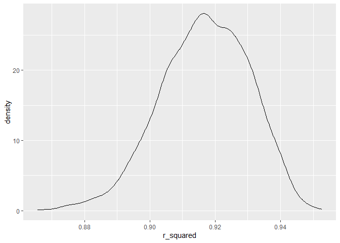
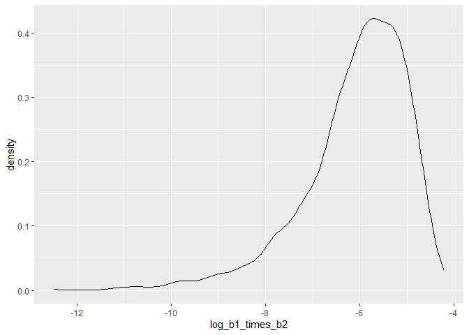
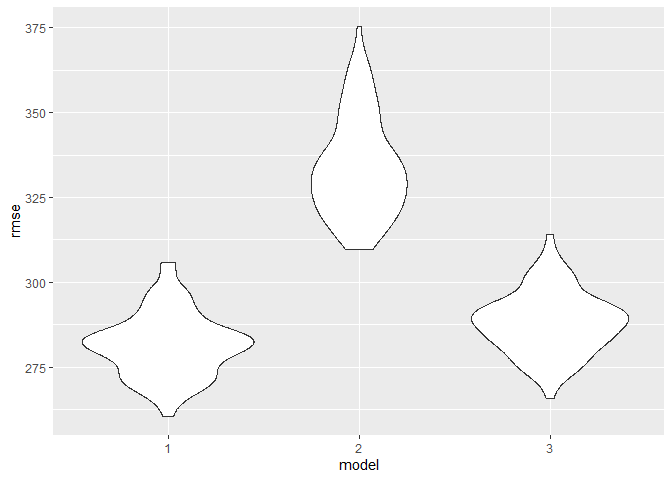

Untitled
================

``` r
knitr::opts_chunk$set(
    message = FALSE,
    warning = FALSE
)
```

``` r
library(tidyverse)
library(modelr)
set.seed(1)
```

# problem 1

``` r
homicide = read_csv('.\\data\\homicide-data.csv')|>
  mutate(city_state = paste(city,state,sep = ', '))|>
  filter(victim_race == 'White' | victim_race == 'Black') |>
  filter(city_state != 'Tulsa, AL')|>
  mutate(resolved = as.numeric(disposition =='Closed by arrest'))|>
  mutate(victim_age = as.numeric(victim_age))

  glm(resolved~ victim_age+victim_sex+victim_race,data = filter(homicide,city_state == 'Baltimore, MD'),family = binomial())|>
  broom::tidy() |> 
  mutate(
    OR = exp(estimate), 
    OR_CI_upper = exp(estimate + 1.96 * std.error),
    OR_CI_lower = exp(estimate - 1.96 * std.error)) |> 
  filter(term == "victim_sexMale") |> 
  select(OR, OR_CI_lower, OR_CI_upper) |>
  knitr::kable(digits = 3)
```

|    OR | OR_CI_lower | OR_CI_upper |
|------:|------------:|------------:|
| 0.426 |       0.325 |       0.558 |

``` r
  result = homicide |> 
  nest(data = -city_state) |> 
  mutate(
    models = map(data, \(df) glm(resolved ~ victim_age + victim_sex + victim_race, 
                             family = binomial(), data = df)),
    tidy_models = map(models, broom::tidy)) |> 
  select(-models, -data) |> 
  unnest(cols = tidy_models) |> 
  mutate(
    OR = exp(estimate), 
    OR_CI_upper = exp(estimate + 1.96 * std.error),
    OR_CI_lower = exp(estimate - 1.96 * std.error)) |> 
  filter(term == "victim_sexMale") |> 
  select(city_state, OR, OR_CI_lower, OR_CI_upper) 
  
  result|>
  slice(1:5) |> 
  knitr::kable(digits = 3)
```

| city_state      |    OR | OR_CI_lower | OR_CI_upper |
|:----------------|------:|------------:|------------:|
| Albuquerque, NM | 1.767 |       0.831 |       3.761 |
| Atlanta, GA     | 1.000 |       0.684 |       1.463 |
| Baltimore, MD   | 0.426 |       0.325 |       0.558 |
| Baton Rouge, LA | 0.381 |       0.209 |       0.695 |
| Birmingham, AL  | 0.870 |       0.574 |       1.318 |

``` r
result |> 
  mutate(city_state = fct_reorder(city_state, OR)) |> 
  ggplot(aes(x = city_state, y = OR)) + 
  geom_point() + 
  geom_errorbar(aes(ymin = OR_CI_lower, ymax = OR_CI_upper)) + 
  theme(axis.text.x = element_text(angle = 90, hjust = 1))
```

<!-- -->

# problem 2

``` r
weather_df = 
  rnoaa::meteo_pull_monitors(
    c("USW00094728"),
    var = c("PRCP", "TMIN", "TMAX"), 
    date_min = "2022-01-01",
    date_max = "2022-12-31") |>
  mutate(
    name = recode(id, USW00094728 = "CentralPark_NY"),
    tmin = tmin / 10,
    tmax = tmax / 10) |>
  select(name, id, everything())

boot_sample = function(df){
   sample_frac(df, replace = TRUE)
}


weather_results = weather_df |>
  modelr::bootstrap(5000)|>
  mutate(
    models = map(strap, \(df) lm(tmax ~ tmin+prcp,data = df))
  )|>
  mutate(
    result_beta = map(models, broom::tidy),
    result_r_square = map(models,broom::glance)
        )|>
  unnest(result_beta)|>
  select(.id,term,estimate,result_r_square)|>
  unnest(result_r_square)|>
  select(.id,term,estimate,r.squared)|>
    pivot_wider(
    names_from = term,
    values_from = estimate
  )|>
  mutate(
    log_b1_times_b2 = log(tmin*prcp)
  )|>
  select(.id,r.squared,log_b1_times_b2)|>
  janitor::clean_names()

weather_results |>
  select(r_squared)|>
  ggplot(aes(x = r_squared))+
  geom_density()
```

<!-- -->

``` r
weather_results |>
  select(log_b1_times_b2)|>
  drop_na()|>
  ggplot(aes(x = log_b1_times_b2))+
  geom_density()
```

<!-- -->

``` r
num_na =  sum(is.na(weather_results$log_b1_times_b2))
```

Distribution of r.squared is normal, and distribution log(beta1\*beta2)
is left skewed.We have a total of 3361 NA for log(beta1\*beta2) in our
data.

``` r
weather_results|> 
  pivot_longer(
    r_squared:log_b1_times_b2,
    values_to = 'value',
    names_to = 'quantities',
  )|>
  group_by(quantities) |> 
  summarize(
    ci_lower = quantile(value, 0.025,na.rm=TRUE), 
    ci_upper = quantile(value, 0.975,na.rm=TRUE))
```

    ## # A tibble: 2 × 3
    ##   quantities      ci_lower ci_upper
    ##   <chr>              <dbl>    <dbl>
    ## 1 log_b1_times_b2   -8.98    -4.60 
    ## 2 r_squared          0.889    0.941

# problem3

``` r
birth_weight = read_csv('.\\data\\birthweight.csv')|>
  mutate(
    babysex = case_when(
      babysex == 1~'male',
      babysex == 2~'female'
    ),
    frace = case_when(
      frace == 1~'White',
      frace == 2~'Black',
      frace == 3~'Asian',
      frace == 4~'Puerto Rican',
      frace == 8~'Other',
      frace == 9~'Unknown',
    ),
    malform = case_when(
      malform == 0~'absent',
      malform == 1~'present'
      
      
    ),
    mrace = case_when(
      mrace == 1~'White',
      mrace == 2~'Black',
      mrace == 3~'Asian',
      mrace == 4~'Puerto Rican',
      mrace == 8~'Other'
   
    )
  )|>
  select(-pnumlbw,-pnumsga)

linmod_0 = lm(bwt~ .,data = birth_weight)|>
  broom::tidy()
```

We first build a model including all variables as predictor, and this
model is just for getting preliminary data of all predictors. Then I
build a new model with predictors chosen by p-value and a little bit
intuition.

``` r
linmod_1 = lm(bwt~ bhead+blength+delwt+gaweeks+smoken+wtgain,data = birth_weight)|>
  broom::tidy()
```

build the other two models.

``` r
linmod_2 <- lm(bwt ~ blength + gaweeks, data = birth_weight)|>
  broom::tidy()
linmod_3 <- lm(bwt ~ bhead * blength * babysex, data = birth_weight)|>
  broom::tidy()
```

``` r
cv_df =
  crossv_mc(birth_weight, 100) |> 
  mutate(
    train = map(train, as_tibble),
    test = map(test, as_tibble))

cv_df = 
  cv_df |> 
  mutate(
    linmod_1  = map(train, \(df)  lm(bwt~ bhead+blength+delwt+gaweeks+smoken+wtgain,data = birth_weight)),
    linmod_2     = map(train, \(df) lm(bwt ~ blength + gaweeks, data = birth_weight)),
    linmod_3  = map(train, \(df) lm(bwt ~ bhead * blength * babysex, data = birth_weight))
    )|> 
  mutate(
    rmse_1 = map2_dbl(linmod_1, test, \(mod, df) rmse(model = mod, data = df)),
    rmse_2   = map2_dbl(linmod_2, test, \(mod, df) rmse(model = mod, data = df)),
    rmse_3 = map2_dbl(linmod_3, test, \(mod, df) rmse(model = mod, data = df)))


cv_df |> 
  select(starts_with("rmse")) |> 
  pivot_longer(
    everything(),
    names_to = "model", 
    values_to = "rmse",
    names_prefix = "rmse_") |> 
  mutate(model = fct_inorder(model)) |> 
  ggplot(aes(x = model, y = rmse)) + geom_violin()
```

<!-- -->

Through the plot, we can see that model_1 has the lowest Root Mean
Squared Error value,so I will pick model_1 be the best model.
